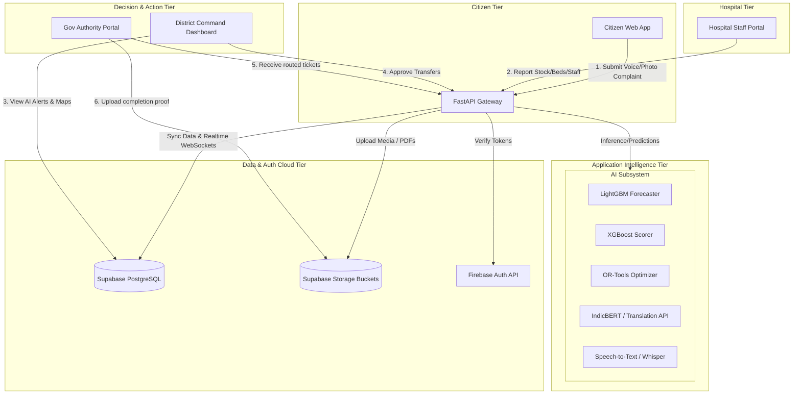

# AarogyaOne — AI-Powered Public Healthcare Intelligence & Resource Management Platform

AarogyaOne (also referred to as *ArogyaPulse* in technical blueprints) is a proactive, data-driven operational intelligence platform designed to bridge critical operational gaps in public healthcare facilities across India. 

Unlike traditional Hospital Management Systems (HMS) that focus strictly on patient records, AarogyaOne optimizes the backend supply chain, bed capacity, doctor attendance, and infrastructure maintenance to ensure rural and urban government healthcare facilities operate at peak efficiency.

---

## 1. The Problem Statement

Public healthcare systems—particularly Primary Health Centres (PHCs), Community Health Centres (CHCs), and District Hospitals—frequently suffer from severe operational bottlenecks:
* **Reactive Resource Allocation**: Authorities only discover that a facility is out of life-saving medicines (like insulin or paracetamol) or has high bed congestion *after* a crisis has already occurred.
* **Underreported Infrastructure Issues**: Defective generators, broken X-Ray machines, and sanitation issues remain unresolved for weeks because of complex government reporting hierarchies.
* **Information Silos**: Central district command centers lack real-time visibility, relying instead on manual, delayed report compilations.
* **Language & Digital Literacy Barriers**: Busy ground-level pharmacists and underprivileged citizens cannot easily report inventory updates or complaints due to language barriers and complex digital interfaces.

---

## 2. Our Solution: AarogyaOne

AarogyaOne connects **Hospitals (Pharmacists, Administrators)**, **District Administrators**, **Government Departments (PWD, Electricity Board, etc.)**, and **Citizens** in a closed-loop operational ecosystem. By injecting AI intelligence directly into logistics, diagnostics, and citizen feedback, it transitions public health management from a reactive posture to a proactive, predictive model.

---

## 3. System Architecture & Diagram

The platform utilizes a decoupled client-server architecture. Next.js handles user interactions across all roles, FastAPI acts as the centralized API gateway and intelligence orchestrator, while Supabase and Firebase host the state.

### Operational Data Flow



---

## 4. Key Features

### 📊 1. District Command Center (The "Wow" Dashboard)
* **Live District Map**: A Leaflet-based interactive GIS map highlighting every public facility in the district. Hospitals are color-coded based on their live status.
* **AI Health Score**: Every facility receives a dynamic score (0-100) calculated using XGBoost. The score accounts for inventory health, bed occupancy, doctor attendance, and citizen grievance trends.
* **Persona Switcher**: A navigation bar that enables demo reviewers to step through the story as a Citizen, Pharmacist, District Administrator, or Government Worker.

### 🔮 2. AI-Driven Forecasting & Inventory Management
* **Inventory Forecasting**: Uses LightGBM to analyze past consumption trends and predict medicine, bed, and oxygen shortages up to 7 days in advance.
* **Smart Stock Tracking**: Pharmacists can use voice commands to add inventory (e.g. speaking in Hindi: *"500 paracetamol packet add karo"*), which is translated and parsed.

### 🚚 3. Automated Resource Redistribution (OR-Tools)
* **Intelligent Transfer Recommendations**: Instead of just alerting that "Stock is Low", the backend uses **Google OR-Tools** to calculate optimized transfer recommendations. 
* It suggests: *"Transfer 300 units of Paracetamol from CHC Pune (4km away - surplus) to PHC Warje (critical shortage)"*, minimizing transit times and logistical friction.

### 🗣️ 4. Multilingual Complaint Intelligence Engine
* **Voice and Photo Grievances**: Citizens can record a voice note in regional Indian languages (Hindi, Marathi, Tamil, etc.) or upload a photo of a broken facility.
* **AI Routing & Severity Assessment**: The backend processes audio using **Whisper** and text using **IndicBERT**. It translates, classifies the department (e.g., PWD vs. Electricity Board), sets severity (Critical/High/Medium), and automatically routes the ticket to the resolver.

### 🏢 5. Government Action & Verification Portal
* **Actionable Tickets**: PWD or medical store personnel log in to see tickets pre-routed to them by the AI.
* **Photographic Proof of Resolution**: Resolvers must upload a photo of the completed work. The vision engine validates the image before allowing the ticket to close.

---

## 5. Technology Stack

* **Frontend**: Next.js 14 (App Router), TypeScript, Tailwind CSS, shadcn/ui, Recharts, Leaflet Maps.
* **Backend**: FastAPI, SQLAlchemy ORM, Uvicorn, PostgreSQL (Supabase), Firebase Admin SDK.
* **Database & Auth**: Supabase PostgreSQL (with WebSockets for Realtime sync), Supabase Storage Buckets, Firebase Client & Admin Auth.
* **AI / Optimization**: PyTorch, Hugging Face Transformers (Whisper, IndicBERT, Florence-2), LightGBM, XGBoost, Google OR-Tools.

---

## 6. Directory Structure

```text
├── ai_models/            # Machine learning model training scripts and weights
├── backend/              # FastAPI Python backend application
│   ├── app/              # FastAPI Application Source Code
│   │   ├── api/          # Route controllers (auth, citizens, hospitals, etc.)
│   │   ├── core/         # Security configs, Firebase init, App settings
│   │   ├── database/     # SQLAlchemy models & Supabase connections
│   │   ├── intelligence/ # AI engines (Forecasting, NLP, Speech, Vision, Optimization)
│   │   └── reports/      # PDF weekly district report templates
│   ├── scripts/          # Database seeding and validator utilities
│   ├── Dockerfile        # Docker container configuration (Optimized for CPU)
│   └── requirements.txt  # Python requirements
├── docs/                 # Hackathon specifications and demo guidelines
├── frontend/             # Next.js React frontend application
│   ├── src/              # Next.js Source Code
│   │   ├── app/          # App Router Pages (landing, dhic, hospital, citizen)
│   │   ├── components/   # UI elements (shadcn components, layouts)
│   │   ├── lib/          # API, Firebase, and Supabase client SDKs
│   │   └── data/         # Mock datasets for quick rendering
├── infrastructure/       # Docker-Compose databases configuration
└── README.md             # Project overview
```

---

## 7. Getting Started

### Local Setup (Development)

#### 1. Setup Backend
1. Navigate to the backend folder:
   ```bash
   cd backend
   ```
2. Create a virtual environment and activate it:
   ```bash
   python -m venv venv
   # On Windows:
   .\venv\Scripts\activate
   # On MacOS/Linux:
   source venv/bin/activate
   ```
3. Install dependencies:
   ```bash
   pip install -r requirements.txt
   ```
4. Copy `.env.example` to `.env` and fill in your Supabase connection strings and Firebase configs.
5. Place your `firebase-adminsdk.json` in the root of the `backend/` directory.
6. Start the API server:
   ```bash
   uvicorn app.main:app --reload
   ```

#### 2. Setup Frontend
1. Navigate to the frontend folder:
   ```bash
   cd ../frontend
   ```
2. Install dependencies:
   ```bash
   npm install
   ```
3. Copy `.env.example` to `.env.local` and add your Firebase client-side config keys and Supabase API URLs.
4. Start the Next.js development server:
   ```bash
   npm run dev
   ```

---

