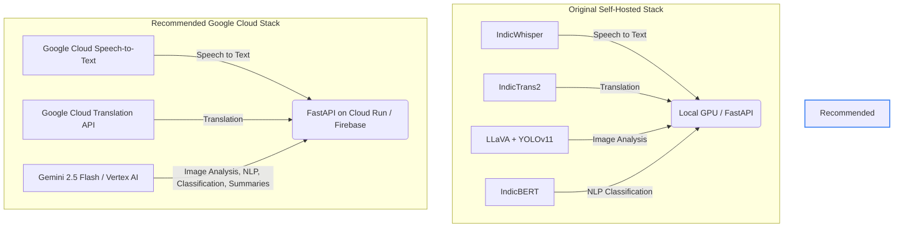

# ArogyaPulse: Hackathon Project Feasibility & Analysis Report

> [!NOTE]
> This analysis evaluates the **ArogyaPulse** blueprint against the **Smart Health: AI-Driven Health Center & Supply Chain Management** theme and the specific hackathon evaluation metrics.

---

## 1. Executive Summary: Is This a Solid Hackathon Project?

**Yes, this is an exceptionally solid, comprehensive, and high-impact hackathon project.** 

The blueprint addresses a real-world, high-priority public infrastructure challenge in India (rural/semi-urban public health operational gaps) with a well-thought-out, multi-stakeholder workflow. It goes beyond a simple "hospital dashboard" and treats the district as a connected ecosystem.

However, to win the hackathon, the current blueprint has one **major strategic misalignment** and a **scope risk** that must be adjusted:
1. **Strategic Misalignment (The Google Cloud Requirement):** The hackathon guidelines explicitly state: *"Utilise Google Cloud technologies to build your working solution."* The blueprint currently proposes a heavy, self-hosted AI stack (IndicWhisper, IndicTrans2, LLaVA, YOLOv11, IndicBERT) requiring local GPU hardware (RTX 4070). This will cost you critical points. You should pivot this to Google Cloud APIs.
2. **Scope Overload:** Building 5 distinct portals with full RBAC, WebSockets, background queues (Celery/Redis), and multiple custom-trained models is extremely difficult to complete and polish in a standard hackathon timeline.

Below is a detailed evaluation of your project against the official judging criteria, followed by recommended adjustments.

---

## 2. Evaluation Parameter Scorecard

| Evaluation Parameter | Weight | Estimated Score (Original Blueprint) | Estimated Score (With Google Cloud Pivots) | Analysis |
| :--- | :---: | :---: | :---: | :--- |
| **Problem-Solution Fit** | 20% | **19/20** | **20/20** | Fits the prompt 100%. Covers stock monitoring, footfall, beds, doctor attendance, and smart redistribution. |
| **AI / Technical Execution** | 25% | **15/25** *(Local stack risk)* | **24/25** | High complexity. Shifting to Google Cloud APIs makes it production-ready and matches Google's judging preferences. |
| **Deployability & Scalability**| 25% | **18/25** *(Heavy hosting)* | **23/25** | A serverless Google Cloud backend (Cloud Run/Firebase) scales infinitely better than self-hosted VMs. |
| **Inclusivity & Accessibility**| 15% | **13/15** | **14/15** | Voice updates and local language translations are phenomenal for ground-level PHC staff. |
| **Impact Potential** | 10% | **10/10** | **10/10** | Solves a critical bottleneck in public health logistics affecting millions. |
| **Presentation & Clarity** | 5% | **4/5** | **5/5** | The Live District Map and AI Health Score are easy for non-technical officials to understand in 5 minutes. |
| **Total** | **100%** | **79/100** | **96/100** | **Outstanding (Potential Winner)** |

---

## 3. Key Strengths of the Blueprint

* **Closed-Loop Ecosystem:** Connecting the **Hospital** (data provider), **District Admin** (decision maker), **Government Authority** (resolver), and **Citizen** (validator) ensures that data actually leads to action.
* **Proactive Resource Optimization:** Using **Google OR-Tools** to recommend transfers instead of just warning that stock is low is a major technical differentiator.
* **Explainable AI (XAI):** The concept of an "AI Health Score" that explains *why* a hospital is underperforming or at risk is highly practical for government administrators.
* **Voice-First Design:** Using voice inputs for busy pharmacists or lower-literacy citizens directly addresses the **Inclusivity** parameter.

---

## 4. Critical Critiques & Strategic Pivots

To maximize your score and ensure you can complete the prototype, we recommend the following pivots:

### Pivot 1: Shift to Google Cloud AI Stack
The blueprint currently uses a local, self-hosted AI stack. Replacing this with Google Cloud services will satisfy the technology requirements, save massive development time, and run faster in the cloud.

* **Replace YOLOv11 & LLaVA with Gemini 2.5 Flash (via Vertex AI / Google AI Studio):**
  * *Why:* Gemini is multimodal. You can send a citizen's photo (e.g., a broken generator or dirty ward) directly to Gemini with a system prompt: *"Classify this hospital infrastructure issue, estimate severity (Critical/High/Medium), and recommend which department (PWD/Electricity Board/Biomedical) should resolve it."* This replaces two heavy models with a single API call.
* **Replace IndicWhisper with Google Cloud Speech-to-Text:**
  * *Why:* Google Cloud STT supports Hindi, Marathi, Tamil, Telugu, and other Indic languages natively with high accuracy and low latency.
* **Replace IndicTrans2 with Google Cloud Translation API:**
  * *Why:* Reliable, fast, and handles all Indian language translations seamlessly.
* **Replace IndicBERT with Gemini API:**
  * *Why:* Gemini can classify, extract entities (e.g., medicine names, quantities from text/voice transcriptions), and run sentiment analysis out of the box with zero training required.

### Pivot 2: Simplify Backend Architecture
Setting up Celery, Redis, WebSockets, and MinIO locally is fine for development but difficult to host and demo under pressure.
* **File Storage:** Use **Google Cloud Storage (GCS)** instead of MinIO. It uses the same concepts, has a simple Python SDK, and is fully managed.
* **Real-time updates:** If real-time synchronization is needed, **Firebase Firestore** or **Firebase Realtime Database** provides real-time listeners out of the box, eliminating the need to write custom WebSocket handlers and manage connection states in FastAPI.
* **Background Tasks:** Instead of Celery+Redis, run asynchronous tasks using FastAPI's built-in `BackgroundTasks` if deploying on **Google Cloud Run**.

---

## 5. Hackathon MVP Scoping (How to Build This in 48 Hours)

Rather than building five completely isolated web applications, build **one cohesive Next.js project** representing the district ecosystem.

### Suggested Navigation & Persona Switcher
Add a persistent **"Persona Switcher"** at the top of your hackathon demo UI. This allows the judges to step through the story:
1. **Citizen View:** Report an issue (e.g., upload a photo of a broken X-Ray or record a Hindi voice note complaining about paracetamol shortage).
2. **Hospital View:** Show the pharmacist's portal. Click "Voice Update" and say *"Add 500 paracetamol"* to see it update. Show the "Low Stock" early warning triggered.
3. **District Command Centre (The "Wow" Page):** Show the Leaflet map with red markers. Click on the flagged hospital. View the AI transfer recommendation (e.g., *"Transfer 300 paracetamol from CHC Pune (4km away) to this PHC"*). Click **Approve**.
4. **Government Authority View:** Log in as "PWD" or "District Medical Store" and show the ticket automatically assigned by the AI. Mark it as resolved.

This narrative flow makes it incredibly easy for judges to understand the value of your platform in under 5 minutes.

---

## 6. Verification Plan & Next Steps

1. **Verify Workspace Setup:** Check if there are any existing starter directories (Frontend/Backend) in the repository.
2. **Setup Firebase/GCP Credentials:** Confirm if GCP credentials or Firebase configuration are available.
3. **Generate Synthetic Data:** Create a script to generate realistic-looking hospital locations, inventory histories, and patient footfall datasets so your charts and map look complete and alive from day one.
